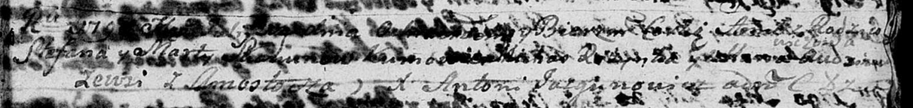

**Скакун Анна Степанова (Skakunowna Anna)**

? июля 1790 г -- крещение (НИАБ 136-13-894, лист 10, №39/1790-р (ориг)).

**НИАБ 136-13-894:** Лист 10. **Метрическая запись №39/1790-р (ориг).**

Дедиловичская Покровская церковь. ? июля 1790 года. Метрическая запись о
крещении.

Skakunowna Anna -- дочь родителей с деревни Замосточье.

Skakun Stefan -- отец.

Skakunowa Marta -- мать.

Rozynko Michaś - кум.

Audziuchowiczowa Ullana? - кума.

Jazgunowicz Antoni -- ксёндз.
