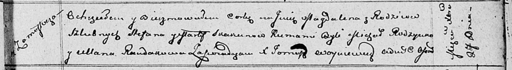

**Скакун Магдалена Степанова (Skakunowna Magdalena)**

27 декабря 1811 г -- крещение (НИАБ 136-13-894, лист 83, №69/1811-р
(ориг)).

**НИАБ 136-13-894:** Лист 83. **Метрическая запись №69/1811-р (ориг).**

Осовская Покровская церковь. 27 декабря 1811 года. Метрическая запись о
крещении.

Skakunowna Magdalena -- дочь родителей с деревни Замосточье.

Skakun Stefan -- отец.

Skakunowa Marta -- мать.

Rodzynko Michał -- кум.

Randakowa Ullana -- кума.

Woyniewicz Tomasz -- ксёндз.
