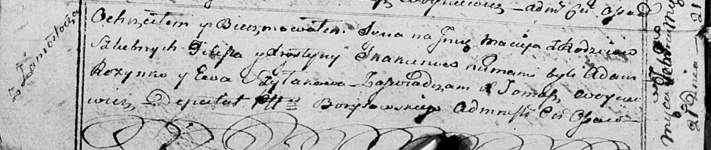

**Скакун Филип (Skakun Filip)**

21 февраля 1815 г -- крещение сына Мацея (НИАБ 136-13-894, лист 91об,
№53/1815-р (ориг)).

**НИАБ 136-13-894:** Лист 91об. **Метрическая запись №9/1815-р (ориг).**

{width="6.496527777777778in"
height="1.3745363079615047in"}

Осовская Покровская церковь. 21 февраля 1815 года. Метрическая запись о
крещении.

Skakun Maciey -- сын родителей с деревни Замосточье.

Skakun Filip -- отец.

Skakunowa Krystyna -- мать.

Rozynko Adam -- кум.

Szyłakowa Ewa -- кума.

Woyniewicz Tomasz -- ксёндз.
