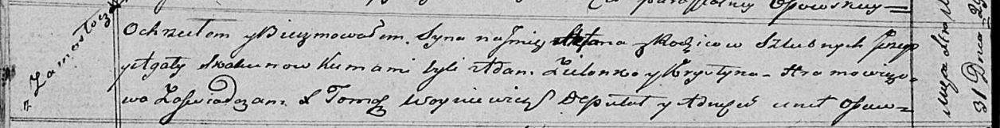

**Скакун Юрий (Skakun Jerzy)**

31 декабря 1819 г -- крещение сына Стефана (НИАБ 136-13-894, лист 103об,
№64/1819-р (ориг)).

**НИАБ 136-13-894:** Лист 103об. **Метрическая запись №64/1819-р
(ориг).**

Осовская Покровская церковь. 31 декабря 1819 года. Метрическая запись о
крещении.

Skakun Stefan -- сын родителей с деревни Замосточье.

Skakun Jerzy -- отец.

Skakunowa Agata -- мать.

Zielonko Adam -- кум.

Hromowiczowa Krystyna -- кума.

Woyniewicz Tomasz -- ксёндз.
