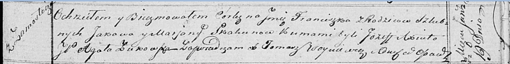

**Скакун Францишка Яковова (Skakunowna Franciszka)**

19 января 1819 г -- крещение (НИАБ 136-13-894, лист 100, №5/1819-р
(ориг)).

**НИАБ 136-13-894:** Лист 100. **Метрическая запись №5/1819-р (ориг).**

Осовская Покровская церковь. 19 января 1819 года. Метрическая запись о
крещении.

Skakunowna Franciszka -- дочь родителей с деревни Замосточье.

Skakun Jakоw -- отец.

Skakunowa Marjana -- мать.

Axiuta Jozef -- кум.

Żukowska Agata -- кума, шляхтянка.

Woyniewicz Tomasz -- ксёндз.
