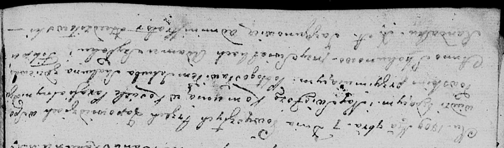
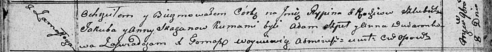

**Скакун (в девичестве Скакун) Анна (Skakunowa Anna z Skakunow)**

7 ноября 1809 г -- венчание с Якубом Скакуном с деревни Замосточье (НИАБ
136-13-920, лист 15об, №16/1809-б (ориг)).

8 ноября 1810 г -- крещение дочери Рыпины (НИАБ 136-13-894, лист 79об,
№56/1810-р (ориг)).

**НИАБ 136-13-920:** Лист 15об. **Метрическая запись №16/1809-б
(ориг).**

Дедиловичская Покровская церковь. 7 ноября 1809 года. Метрическая запись
о венчании.

Skakun Jakub -- жених, с деревни \[Замосточье\].

Skakunowa Anna -- невеста, девка.

Szyłak Adam -- свидетель.

Randak Filip -- свидетель.

Jazgunowicz Antoni -- ксёндз.

**НИАБ 136-13-894:** Лист 79об. **Метрическая запись №56/1810-р
(ориг).**

Осовская Покровская церковь. 8 ноября 1810 года. Метрическая запись о
крещении.

Skakunowna Rypina -- дочь родителей с деревни Замосточье.

Skakun Jakub -- отец.

Skakunowa Anna -- мать.

Szpet Adam -- кум.

Dudaronkowa Anna -- кума.

Woyniewicz Tomasz -- ксёндз.
