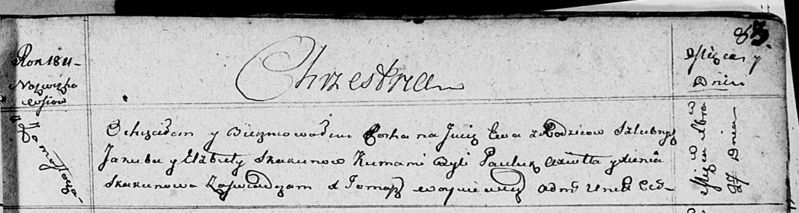

**Скакун Ева Якубова (Skakunowna Ewa)**

27 декабря 1811 г -- крещение (НИАБ 136-13-894, лист 83, №68/1811-р
(ориг)).

**НИАБ 136-13-894:** Лист 83. **Метрическая запись №68/1811-р (ориг).**

Осовская Покровская церковь. 27 декабря 1811 года. Метрическая запись о
крещении.

Skakunowna Ewa -- дочь родителей с деревни Замосточье.

Skakun Jakub -- отец.

Skakunowa Elżbieta -- мать.

Axiuta Pauluk -- кум.

Skakunowa Xienia -- кума.

Woyniewicz Tomasz -- ксёндз.
