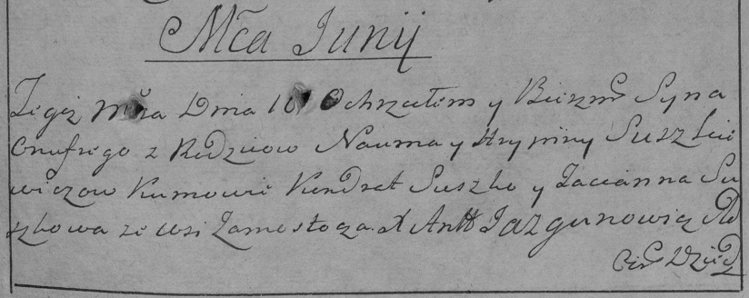

**Сушкевич Наум (Suszkiewicz Naum)**

10 июня 1785 г -- крещение сына Онуфрыя (РГИА 823-2-18, лист 229,
№15/1785-р (коп)).

**РГИА 823-2-18:** Лист 229. **Метрическая запись №15/1785-р (коп).**

{width="6.496527777777778in"
height="2.5861111111111112in"}

Дедиловичская Покровская церковь. 10 июня 1785 года. Метрическая запись
о крещении.

Suszkiewicz Onufry -- сын родителей с деревни Замосточье.

Suszkiewicz Naum -- отец.

Suszkiewiczowa Hrypina -- мать.

Suszko Kondrat -- кум.

Suszkowa Tacianna - кума.

Jazgunowicz Antoni -- ксёндз.
