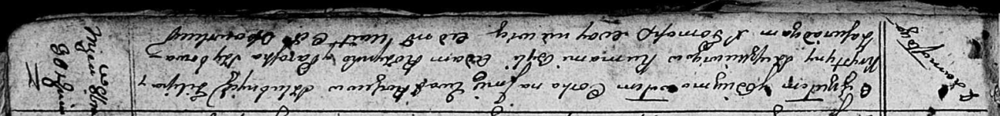

**Сушкевич, Шушкевич Ева Филипова (Szuszkiewiczowna Ewa)**

30 октября 1810 г -- крещение (НИАБ 136-13-894, лист 79, №53/1810-р
(ориг)).

**НИАБ 136-13-894:** Лист 79. **Метрическая запись №53/1810-р (ориг).**

{width="6.496527777777778in"
height="0.757671697287839in"}

Осовская Покровская церковь. 30 октября 1810 года. Метрическая запись о
крещении.

Szuszkiewiczowna Ewa -- дочь родителей с деревни Замосточье.

Szuszkiewicz Filip -- отец.

Szuszkiewiczowa Krystyna -- мать.

Rozynko Adam -- кум.

Szyłowa Paraska -- кума.

Woyniewicz Tomasz -- ксёндз.
