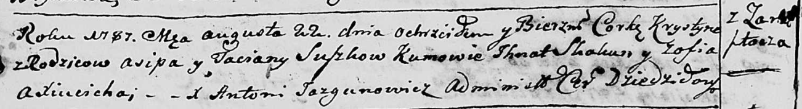

**Сушко Асип (Suszko Asip)**

22 августа 1787 г -- крещение дочери Хрыстыны (НИАБ 136-13-894, лист
2об, №40/1787-р (ориг)).

**НИАБ 136-13-894:** Лист 2об. **Метрическая запись №40/1787-р (ориг).**

{width="6.496527777777778in"
height="0.8931135170603675in"}

Дедиловичская Покровская церковь. 22 августа 1787 года. Метрическая
запись о крещении.

Suszkowna Krystyna - дочь родителей с деревни Замосточье.

Suszko Asip -- отец.

Suszkowa Taciana -- мать.

Skakun Jhnat - кум.

Axiucicha Zofia - кума.

Jazgunowicz Antoniusz -- ксёндз.
