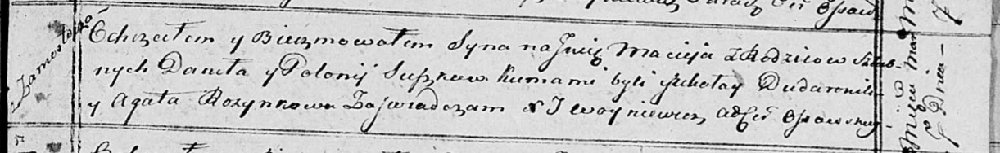

**Сушко Данила (Szuszko, Suszko Daniła)**

13 ноября 1810 г -- венчание с девкой Полонией Томкович с деревни Осово
(НИАБ 136-13-920, лист 17, №11/1810-б (ориг)).

29 октября 1811 г -- крещение дочери Крыстыны (НИАБ 136-13-894, лист 82,
№53/1811-р (ориг)).

7 марта 1815 г -- крещение сына Мацея (НИАБ 136-13-894, лист 92,
№11/1815-р (ориг)).

**НИАБ 136-13-920:** Лист 17. **Метрическая запись №11/1810-б (ориг).**

{width="6.496527777777778in"
height="1.2799945319335082in"}

Осовская Покровская церковь. 13 ноября 1810 года. Метрическая запись о
венчании.

Szuszko Daniel -- жених, молодой, парафии Осовской, с деревни
Замосточье.

Tomkowiczowna Połonija -- невеста, девка, парафии Осовской, с деревни
Осово.

Zielonka Maciey -- свидетель.

Tomkowicz Jzydor -- свидетель.

Woyniewicz Tomasz -- ксёндз.

**НИАБ 136-13-894:** Лист 82. **Метрическая запись №53/1811-р (ориг).**

{width="6.496527777777778in"
height="0.8247222222222222in"}

Осовская Покровская церковь. 29 октября 1811 года. Метрическая запись о
крещении.

Szuszkowna Krystyna -- дочь родителей с деревни Замосточье.

Szuszko Danila -- отец.

Szuszkowa Połonija -- мать.

Szyło Jozef -- кум.

Rozynkowa Agata -- кума.

Woyniewicz Tomasz -- ксёндз.

**НИАБ 136-13-894:** Лист 92. **Метрическая запись №11/1815-р (ориг).**

{width="6.496527777777778in"
height="1.0003937007874015in"}

Осовская Покровская церковь. 7 марта 1815 года. Метрическая запись о
крещении.

Suszko Maciey -- сын родителей с деревни Замосточье.

Suszko Daniła -- отец.

Suszkowa Połonija -- мать.

Dudaronek Mikołay -- кум.

Rozynkowa Agata -- кума.

Woyniewicz Tomasz -- ксёндз.
