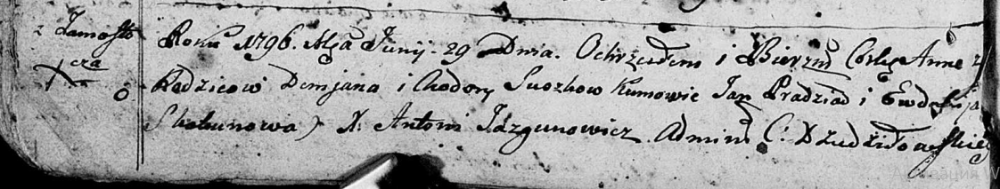

**Сушко Анна Демьянова (Suszkowna Anna)**

29 июня 1796 г -- крещение (НИАБ 136-13-894, лист 29об, №63/1796-р
(ориг)).

**НИАБ 136-13-894:** Лист 29-об. **Метрическая запись №63/1796-р
(ориг).**

{width="6.496527777777778in"
height="1.2330599300087488in"}

Дедиловичская Покровская церковь. 29 июня 1796 года. Метрическая запись
о крещении.

Suszkowna Anna -- дочь родителей с деревни Замосточье.

Suszko Demjan -- отец.

Suszkowa Chodora -- мать.

Pradziad Jan - кум.

Skakunowa Ewdokija - кума.

Jazgunowicz Antoni -- ксёндз.
