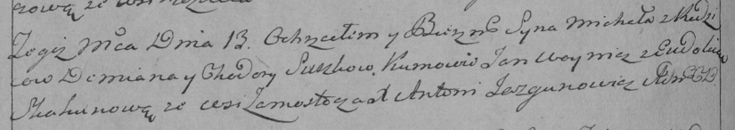

**Сушко Демьян (Suszko Dziemian)**

25 февраля 1784 г -- крещение дочери Евдокии (РГИА 823-2-18, лист 226,
№6/1784-р (коп)).

13 ноября 1793 г -- крещение сына Михала (НИАБ 136-13-894, лист 20об,
№79/1793-р (ориг)), (РГИА 823-2-18, лист 248об, №45/1793-р (коп)).

29 июня 1796 г -- крещение дочери Анны (НИАБ 136-13-894, лист 29об,
№63/1796-р (ориг)).

**РГИА 823-2-18:** Лист 226. **Метрическая запись №6/1784-р (коп).**

{width="6.496527777777778in"
height="1.7638888888888888in"}

Дедиловичская Покровская церковь. 25 февраля 1784 года. Метрическая
запись о крещении.

Suszkowna Ewdokia -- дочь родителей с деревни Замосточье.

Suszko Dziemian -- отец.

Suszkowa Chwiedora -- мать.

Nowik Jan -- кум.

Skakunowa Magdalena - кума.

Jazgunowicz Antoni -- ксёндз.

**НИАБ 136-13-894:** Лист 20-об. **Метрическая запись №79/1793-р
(ориг).**

{width="6.496527777777778in"
height="1.2719488188976378in"}

Дедиловичская Покровская церковь. 13 ноября 1793 года. Метрическая
запись о крещении.

Suszko Michał -- сын родителей с деревни Замосточье.

Suszko Dziemjan -- отец.

Suszkowa Chodora-- мать.

Woynicz Jan - кум.

Skakunowa Ewdokija - кума.

Jazgunowicz Antoni -- ксёндз.

**РГИА 823-2-18:** Лист 248об. **Метрическая запись №45/1793-р (коп).**

{width="6.496527777777778in"
height="1.15in"}

Дедиловичская Покровская церковь. 13 ноября 1793 года. Метрическая
запись о крещении.

Suszko Michał -- сын родителей с деревни Замосточье.

Suszko Demian -- отец.

Suszkowa Chodora -- мать.

Woynicz Jan -- кум.

Skakunowa Eudokia -- кума.

Jazgunowicz Antoni -- ксёндз.

**НИАБ 136-13-894:** Лист 29-об. **Метрическая запись №63/1796-р
(ориг).**

{width="6.496527777777778in"
height="1.2330599300087488in"}

Дедиловичская Покровская церковь. 29 июня 1796 года. Метрическая запись
о крещении.

Suszkowna Anna -- дочь родителей с деревни Замосточье.

Suszko Demjan -- отец.

Suszkowa Chodora -- мать.

Pradziad Jan - кум.

Skakunowa Ewdokija - кума.

Jazgunowicz Antoni -- ксёндз.
