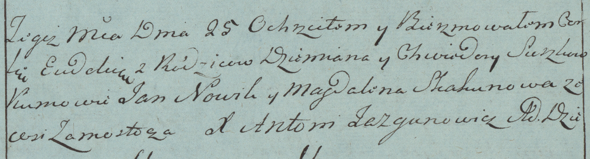

**Сушко Евдокия Демьянова (Suszko Eudokija)**

25 февраля 1784 г -- крещение (РГИА 823-2-18, лист 226, №6/1784-р
(коп)).

**РГИА 823-2-18:** Лист 226. **Метрическая запись №6/1784-р (коп).**

Дедиловичская Покровская церковь. 25 февраля 1784 года. Метрическая
запись о крещении.

Suszkowna Ewdokia -- дочь родителей с деревни Замосточье.

Suszko Dziemian -- отец.

Suszkowa Chwiedora -- мать.

Nowik Jan -- кум.

Skakunowa Magdalena - кума.

Jazgunowicz Antoni -- ксёндз.
