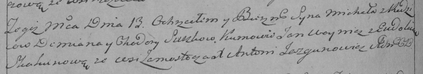

**Сушко Михал Демьянов (Suszko Michał)**

13 ноября 1793 г -- крещение (НИАБ 136-13-894, лист 20об, №79/1793-р
(ориг)), (РГИА 823-2-18, лист 248об, №45/1793-р (коп)).

**НИАБ 136-13-894:** Лист 20-об. **Метрическая запись №79/1793-р
(ориг).**

{width="6.496527777777778in"
height="1.2719488188976378in"}

Дедиловичская Покровская церковь. 13 ноября 1793 года. Метрическая
запись о крещении.

Suszko Michał -- сын родителей с деревни Замосточье.

Suszko Dziemjan -- отец.

Suszkowa Chodora-- мать.

Woynicz Jan - кум.

Skakunowa Ewdokija - кума.

Jazgunowicz Antoni -- ксёндз.

**РГИА 823-2-18:** Лист 248об. **Метрическая запись №45/1793-р (коп).**

{width="6.496527777777778in"
height="1.15in"}

Дедиловичская Покровская церковь. 13 ноября 1793 года. Метрическая
запись о крещении.

Suszko Michał -- сын родителей с деревни Замосточье.

Suszko Demian -- отец.

Suszkowa Chodora -- мать.

Woynicz Jan -- кум.

Skakunowa Eudokia -- кума.

Jazgunowicz Antoni -- ксёндз.
