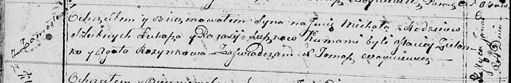

**Сушко Парася (Suszkowa Parasia)**

24 января 1815 г -- крещение сына Михала (НИАБ 136-13-894, лист 91об,
№5/1815-б (ориг)).

**НИАБ 136-13-894:** Лист 91об. **Метрическая запись №5/1815-р (ориг).**

Осовская Покровская церковь. 24 января 1815 года. Метрическая запись о
крещении.

Suszko Michał -- сын родителей с деревни Замосточье.

Suszko Łukasz -- отец.

Suszkowa Parasia -- мать.

Zielonko Maciey -- кум.

Rozynkowa Agata -- кума.

Woyniewicz Tomasz -- ксёндз.
