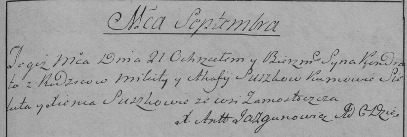
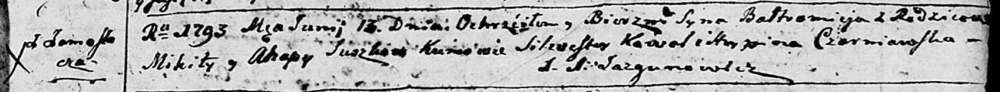

**Сушко Агафия (Suszkowa Ahafija, Ahapa)**

21 сентября 1785 г -- крещение сына Кондрата (РГИА 823-2-18, лист 230,
№23/1785-р (коп)).

13 июня 1793 г -- крещение сына Балтромея (НИАБ 136-13-894, лист 20,
№50/1793-р (ориг)), (РГИА 823-2-18, лист 247об, №24/1793-р (коп)).

**РГИА 823-2-18:** Лист 230. **Метрическая запись №23/1785-р (коп).**

Дедиловичская Покровская церковь. 21 сентября 1785 года. Метрическая
запись о крещении.

Suszko Kondrat -- сын родителей с деревни Замосточье.

Suszko Mikita -- отец.

Suszkowa Ahafija -- мать.

Sieluta -- кум.

Suszkowa Xienia - кума.

Jazgunowicz Antoni -- ксёндз.

**НИАБ 136-13-894:** Лист 20. **Метрическая запись №50/1793-р (ориг).**

Дедиловичская Покровская церковь. 13 июня 1793 года. Метрическая запись
о крещении.

Suszko Bałtromey -- сын родителей с деревни Замосточье.

Suszko Mikita -- отец.

Suszkowa Ahapa -- мать.

Kawal Silvester - кум.

Czarniawska Hrypina - кума.

Jazgunowicz Antoni -- ксёндз.

**РГИА 823-2-18:** Лист 247об. **Метрическая запись №24/1793-р (коп).**

Дедиловичская Покровская церковь. 13 июня 1793 года. Метрическая запись
о крещении.

\[Suszko\] Bałtromiey -- сын родителей с деревни Замосточье.

\[Suszko\] Mikita -- отец.

\[Suszkowa\] Ahapa -- мать.

Kowal Silwester -- кум.

Czarniawska Hrypina -- кума.

Jazgunowicz Antoni -- ксёндз.
