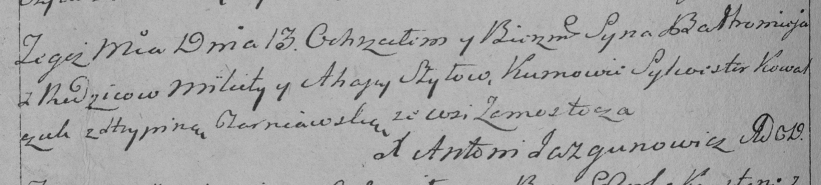

**Сушко Балтромей Микитов (Suszko Bałtromiey)**

13 июня 1793 г -- крещение (НИАБ 136-13-894, лист 20, №50/1793-р
(ориг)), (РГИА 823-2-18, лист 247об, №24/1793-р (коп)).

**НИАБ 136-13-894:** Лист 20. **Метрическая запись №50/1793-р (ориг).**

{width="6.496527777777778in"
height="0.6014435695538057in"}

Дедиловичская Покровская церковь. 13 июня 1793 года. Метрическая запись
о крещении.

Suszko Bałtromey -- сын родителей с деревни Замосточье.

Suszko Mikita -- отец.

Suszkowa Ahapa -- мать.

Kawal Silvester - кум.

Czarniawska Hrypina - кума.

Jazgunowicz Antoni -- ксёндз.

**РГИА 823-2-18:** Лист 247об. **Метрическая запись №24/1793-р (коп).**

{width="6.496527777777778in"
height="1.4638888888888888in"}

Дедиловичская Покровская церковь. 13 июня 1793 года. Метрическая запись
о крещении.

\[Suszko\] Bałtromiey -- сын родителей с деревни Замосточье.

\[Suszko\] Mikita -- отец.

\[Suszkowa\] Ahapa -- мать.

Kowal Silwester -- кум.

Czarniawska Hrypina -- кума.

Jazgunowicz Antoni -- ксёндз.
