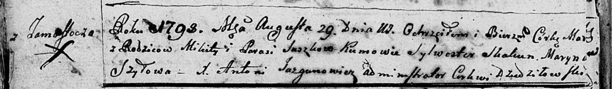
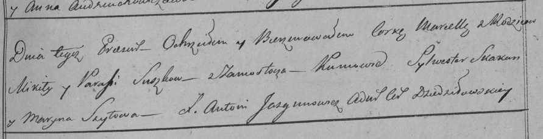

**Сушко Парася (Suszkowa Parasia)**

29 августа 1798 г -- крещение дочери Марцеллы (НИАБ 136-13-894, лист
36об, №40/1798-р (ориг)), (РГИА 823-2-18, лист 265, №39/1798-р (коп)).

**НИАБ 136-13-894:** Лист 36об. **Метрическая запись №40/1798-р
(ориг).**

Дедиловичская Покровская церковь. 29 августа 1798 года. Метрическая
запись о крещении.

Suszkowna Mar\[cella\] -- дочь родителей с деревни Замосточье.

Suszko Mikita -- отец.

Suszkowa Parasia -- мать.

Skakun Sylwester - кум.

Szyłowa Maryna - кума.

Jazgunowicz Antoni -- ксёндз.

**РГИА 823-2-18:** Лист 265. **Метрическая запись №40/1798-р (коп).**

Дедиловичская Покровская церковь. 29 августа 1798 года. Метрическая
запись о крещении.

Suszkowna Marcella -- дочь родителей с деревни Замосточье.

Suszko Mikita -- отец.

Suszkowa Paraska -- мать.

Skakun Sylwester -- кум.

Szyłowa Maryna -- кума.

Jazgunowicz Antoni -- ксёндз.
