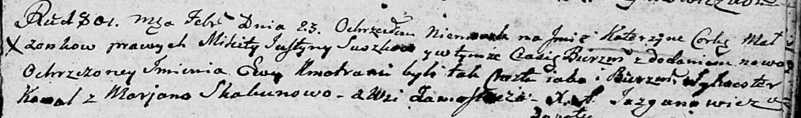

**Сушко Катерына Микитова (Suszkowna Katerzyna Ewa)**

23 февраля 1802 г -- крещение (НИАБ 136-13-894, лист 46, №7/1802-р
(ориг)).

**НИАБ 136-13-894:** Лист 46. **Метрическая запись №7/1802-р (ориг).**

Дедиловичская Покровская церковь. 23 февраля 1802 года. Метрическая
запись о крещении.

Suszkowna Katerzyna Ewa -- дочь родителей с деревни Замосточье.

Suszko Mikita -- отец.

Suszkowa Justyna -- мать.

Kawal Sylwester -- кум.

Skakunowa Marjana -- кума.

Jazgunowicz Antoni -- ксёндз.
