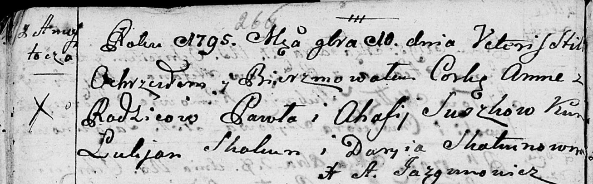
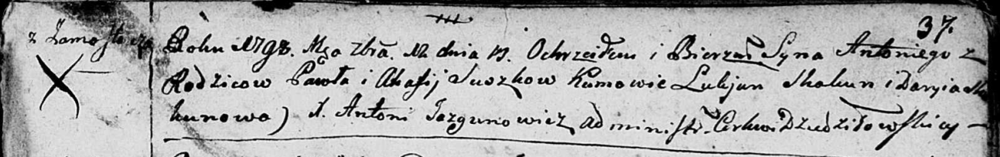
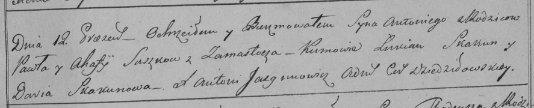

**Сушко Агафия (Suszkowa Ahafija)**

16 января 1793 г -- крещение сына Петра (НИАБ 136-13-894, лист 18,
№8/1793-р (ориг)), (РГИА 823-2-18, лист 246, №3/1793-р (коп)).

10 ноября 1795 г -- крещение дочери Анны (НИАБ 136-13-894, лист 26об,
№53/1795-р (ориг)).

12 сентября 1798 г -- крещение сына Антона (НИАБ 136-13-894, лист 37,
№42/1798-р (ориг)), (РГИА 823-2-18, лист 266, №43/1798-р (коп)).

**НИАБ 136-13-894:** Лист 18. **Метрическая запись №8/1793-р (ориг).**

Дедиловичская Покровская церковь. 16 января 1793 года. Метрическая
запись о крещении.

Suszko Piotr -- сын родителей с деревни Замосточье.

Suszko Paweł -- отец.

Suszko Ahafija -- мать.

Skakun Łukjan -- кум.

Skakunowa Daryia -- кума.

Jazgunowicz Antoni -- ксёндз.

**РГИА 823-2-18:** Лист 246. **Метрическая запись №3/1793-р (коп).**

Дедиловичская Покровская церковь. 16 января 1793 года. Метрическая
запись о крещении.

Suszko Piotr -- сын родителей с деревни Замосточье.

Suszko Paweł -- отец.

Suszkowa Ahafija -- мать.

Skakun Łukjan -- кум.

Skakunowa Daria -- кума.

Jazgunowicz Antoni -- ксёндз.

**НИАБ 136-13-894:** Лист 26об. **Метрическая запись №53/1795-р
(ориг).**

Дедиловичская Покровская церковь. 10 ноября 1795 года. Метрическая
запись о крещении.

Suszkowna Anna -- дочь родителей с деревни Замосточье.

Suszko Paweł -- отец.

Suszkowa Ahafija -- мать.

Skakun Łukjan - кум.

Skakunowna Daryia - кума.

Jazgunowicz Antoni -- ксёндз.

**НИАБ 136-13-894:** Лист 37. **Метрическая запись №42/1798-р (ориг).**

Дедиловичская Покровская церковь. 12 сентября 1798 года. Метрическая
запись о крещении.

Suszko Antoni -- сын родителей с деревни Замосточье.

Suszko Paweł -- отец.

Suszko Ahafija -- мать.

Skakun Łukjan - кум.

Skakunowa Daryia - кума.

Jazgunowicz Antoni -- ксёндз.

**РГИА 823-2-18:** Лист 266. **Метрическая запись №43/1798-р (коп).**

Дедиловичская Покровская церковь. 12 сентября 1798 года. Метрическая
запись о крещении.

Suszko Antoni -- сын родителей с деревни Замосточье.

Suszko Paweł -- отец.

Suszkowa Ahafija -- мать.

Skakun Łukian -- кум.

Skakunowa Daria -- кума.

Jazgunowicz Antoni -- ксёндз.
