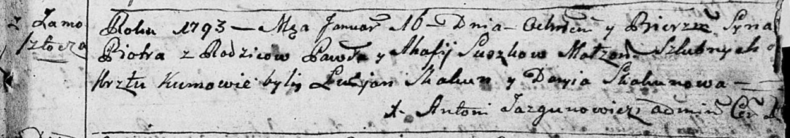
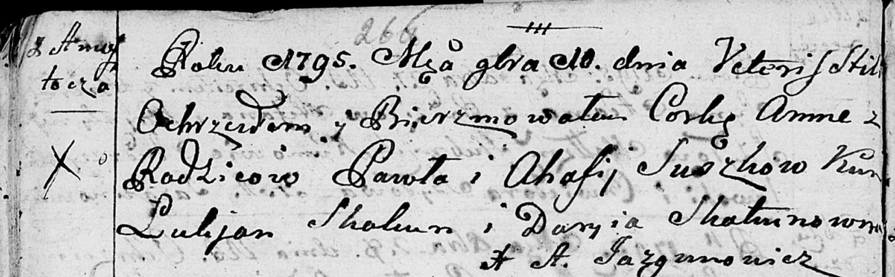
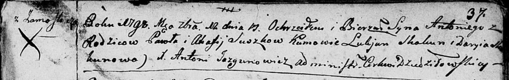
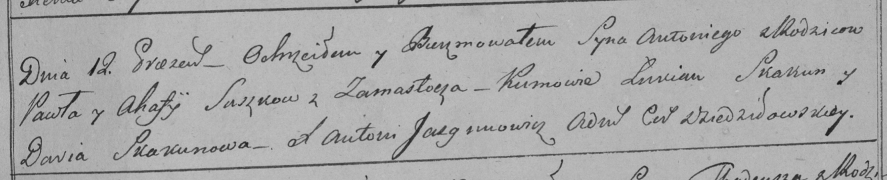

**Сушко Павел (Suszko Paweł)**

16 января 1793 г -- крещение сына Петра (НИАБ 136-13-894, лист 18,
№8/1793-р (ориг)), (РГИА 823-2-18, лист 246, №3/1793-р (коп)).

10 ноября 1795 г -- крещение дочери Анны (НИАБ 136-13-894, лист 26об,
№53/1795-р (ориг)).

Сентябрь 1797 г -- свидетель венчания Грышки Белявского с деревни
Замосточье с вдовой Катерыной Белявской (НИАБ 136-13-920, лист 4об,
№7/1797-б (ориг)).

12 сентября 1798 г -- крещение сына Антона (НИАБ 136-13-894, лист 37,
№42/1798-р (ориг)), (РГИА 823-2-18, лист 266, №43/1798-р (коп)).

8 апреля 1803 г -- крестный отец у Марыи Паракседы, дочери Зелёнков
Грышки и Катерыны с деревни Замосточье (НИАБ 136-13-894, лист 50,
№15/1803-р (ориг)).

**НИАБ 136-13-894:** Лист 18. **Метрическая запись №8/1793-р (ориг).**

Дедиловичская Покровская церковь. 16 января 1793 года. Метрическая
запись о крещении.

Suszko Piotr -- сын родителей с деревни Замосточье.

Suszko Paweł -- отец.

Suszko Ahafija -- мать.

Skakun Łukjan -- кум.

Skakunowa Daryia -- кума.

Jazgunowicz Antoni -- ксёндз.

**РГИА 823-2-18:** Лист 246. **Метрическая запись №3/1793-р (коп).**

Дедиловичская Покровская церковь. 16 января 1793 года. Метрическая
запись о крещении.

Suszko Piotr -- сын родителей с деревни Замосточье.

Suszko Paweł -- отец.

Suszkowa Ahafija -- мать.

Skakun Łukjan -- кум.

Skakunowa Daria -- кума.

Jazgunowicz Antoni -- ксёндз.

**НИАБ 136-13-894:** Лист 26об. **Метрическая запись №53/1795-р
(ориг).**

Дедиловичская Покровская церковь. 10 ноября 1795 года. Метрическая
запись о крещении.

С Замосточья.

Suszkowa Anna -- дочь супругов, деревня Замосточье.

Suszko Paweł -- отец, деревня Замосточье.

Suszkowa Ahafija -- мать, деревня Замосточье.

Skakun Łukjan - кум.

Skakunowna Daryia - кума.

Jazgunowicz Antoni -- ксёндз, проводивший таинства, администратор
церкви.

**НИАБ 136-13-920:** Лист 4об. **Метрическая запись №7/1797-б (ориг).**

Дедиловичская Покровская церковь. Сентября 1797 года. Метрическая запись
о венчании.

Zielonka Hryszka -- жених, с деревни Замосточье.

Bielawska Katerzyna -- невеста, вдова.

Suszko Paweł -- свидетель, с деревни Замосточье.

Jacewicz Jozef -- свидетель, с местечка Докшицы.

Jazgunowicz Antoni -- ксёндз.

**НИАБ 136-13-894:** Лист 37. **Метрическая запись №42/1798-р (ориг).**

Дедиловичская Покровская церковь. 12 сентября 1798 года. Метрическая
запись о крещении.

Suszko Antoni -- сын родителей с деревни Замосточье.

Suszko Paweł -- отец.

Suszko Ahafija -- мать.

Skakun Łukjan - кум.

Skakunowa Daryia - кума.

Jazgunowicz Antoni -- ксёндз.

**РГИА 823-2-18:** Лист 266. **Метрическая запись №43/1798-р (коп).**

Дедиловичская Покровская церковь. 12 сентября 1798 года. Метрическая
запись о крещении.

Suszko Antoni -- сын родителей с деревни Замосточье.

Suszko Paweł -- отец.

Suszkowa Ahafija -- мать.

Skakun Łukian -- кум.

Skakunowa Daria -- кума.

Jazgunowicz Antoni -- ксёндз.

**НИАБ 136-13-894:** Лист 50. **Метрическая запись №15/1803-р (ориг).**

Дедиловичская Покровская церковь. 8 апреля 1803 года. Метрическая запись
о крещении.

Zielonkowna Marya Paraxeda -- дочь родителей с деревни Замосточье.

Zielonka Hryhor -- отец.

Zielonkowa Katerzyna -- мать.

Suszko Paweł -- кум, с деревни Замосточье.

Suszkowa Taciana -- кума, с деревни Замосточье.

Jazgunowicz Antoni -- ксёндз.
