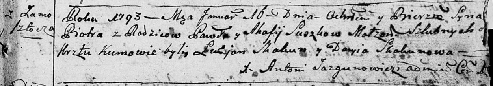
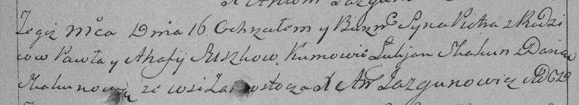

**Сушко Пётр Павлов (Suszko Piotr)**

16 января 1793 г -- крещение (НИАБ 136-13-894, лист 18, №8/1793-р
(ориг)), (РГИА 823-2-18, лист 246, №3/1793-р (коп)).

**НИАБ 136-13-894:** Лист 18. **Метрическая запись №8/1793-р (ориг).**

Дедиловичская Покровская церковь. 16 января 1793 года. Метрическая
запись о крещении.

Suszko Piotr -- сын родителей с деревни Замосточье.

Suszko Paweł -- отец.

Suszko Ahafija -- мать.

Skakun Łukjan -- кум.

Skakunowa Daryia -- кума.

Jazgunowicz Antoni -- ксёндз.

**РГИА 823-2-18:** Лист 246. **Метрическая запись №3/1793-р (коп).**

Дедиловичская Покровская церковь. 16 января 1793 года. Метрическая
запись о крещении.

Suszko Piotr -- сын родителей с деревни Замосточье.

Suszko Paweł -- отец.

Suszkowa Ahafija -- мать.

Skakun Łukjan -- кум.

Skakunowa Daria -- кума.

Jazgunowicz Antoni -- ксёндз.
