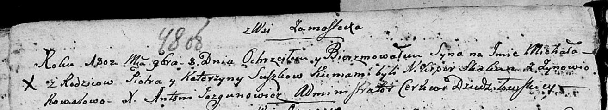

**Сушко Катерына (Suszkowa Katerzyna)**

8 ноября 1802 г -- крещение сына Михася (НИАБ 136-13-894, лист 48об,
№36/1802-р (ориг)).

**НИАБ 136-13-894:** Лист 48об. **Метрическая запись №39/1802-р
(ориг).**

{width="6.496527777777778in"
height="1.1867946194225723in"}

Дедиловичская Покровская церковь. 8 ноября 1802 года. Метрическая запись
о крещении.

Suszko Michaś -- сын родителей с деревни Замосточье.

Suszko Piotr -- отец.

Suszkowa Katerzyna -- мать.

Skakun Nikiper -- кум.

Kowalowa Zynowia -- кума.

Jazgunowicz Antoni -- ксёндз.
