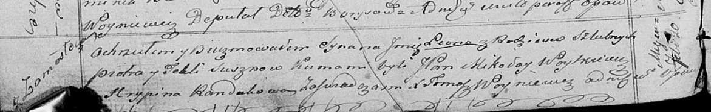

**Сушко Текля (Suszkowa Tekla)**

20 февраля 1821 г -- крещение сына Леона (НИАБ 136-13-894, лист 105об,
№9/1821-р (ориг)).

**НИАБ 136-13-894:** Лист 105об. **Метрическая запись №9/1821-р
(ориг).**

{width="6.496527777777778in"
height="1.0319083552055992in"}

Осовская Покровская церковь. 20 февраля 1821 года. Метрическая запись о
крещении.

Suszko Leon -- сын родителей с деревни Замосточье.

Suszko Piotr -- отец.

Suszkowa Tekla -- мать.

Woytkiewicz Mikołay, JP -- кум, шляхтич.

Randakowa Hrypina -- кума.

Woyniewicz Tomasz -- ксёндз.
