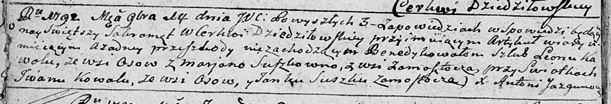

**Коренько (в девичестве Сушко) Евдокия (Koreńkowa Eudokija z
Szuszkow)**

12 ноября 1811 г -- венчание с вдовцом Онуфрыем Коренько с деревни
Замосточье (НИАБ 136-13-920, лист 18, №12/1811-б (ориг)).

**НИАБ 136-13-920:** Лист 18. **Метрическая запись №12/1811-б (ориг).**

{width="6.496527777777778in"
height="1.3906288276465442in"}

Осовская Покровская церковь. 12 ноября 1811 года. Метрическая запись о
венчании.

Kuczeńkow \[Koreńko\] Onufry -- жених, вдовец, парафии Осовской, с
деревни Замосточье.

Szuszkowna Eudokija -- невеста, девка, парафии Осовской, с деревни
Замосточье.

Zielonka Maciey -- свидетель.

Szusza Piotr -- свидетель.

Woyniewicz Tomasz -- ксёндз.
