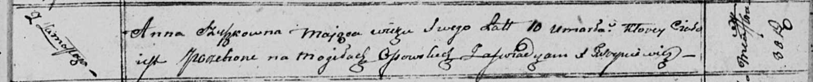

**Сушко Анна (Szuszkowna Anna)**

30 сентября 1810 г -- отпевание, умерла в возрасте 10 лет (родилась
около 1800 г) (НИАБ 136-13-919, лист 22, №7/1810-у (ориг)).

**НИАБ 136-13-919:** Лист 22. **Метрическая запись №7/1810-у (ориг).**

Осовская униатская церковь. 30 сентября 1810 года. Метрическая запись об
отпевании.

Szuszkowna Anna -- умершая, 10 лет, с деревни Замосточье, похоронена на
кладбище деревни Осово.

Woyniewicz Tomasz -- ксёндз.
