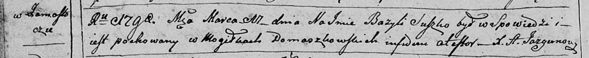

**Сушко Базыль (Suszko Bazyli)**

17 марта 1798 г -- отпевание (НИАБ 136-13-919, лист 7об, №7/1798-у
(ориг)).

**НИАБ 136-13-919:** Лист 7об. **Метрическая запись №7/1798-у (ориг).**

Дедиловичская Покровская церковь. 17 марта 1798 года. Метрическая запись
об отпевании.

Suszko Bazyli -- умерший, с деревни Замосточье, похоронен на кладбище
деревни Домашковичи.

Jazgunowicz Antoni -- ксёндз.
