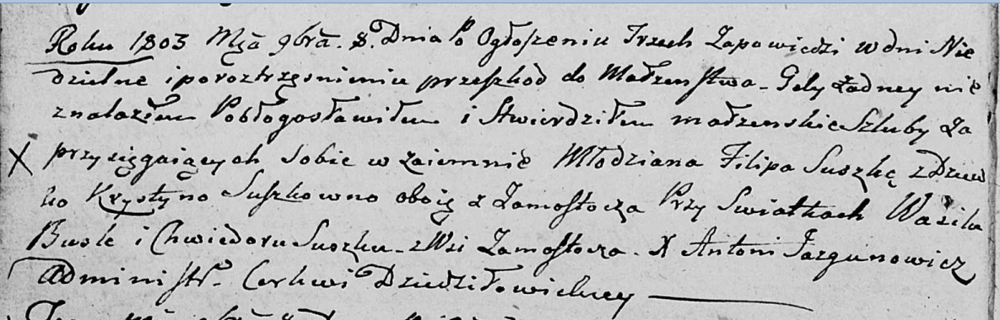

**Сушко Хведор (Suszko Chwiedor)**

8 ноября 1803 г -- свидетель венчания молодого Филипа Сушко с деревни
Замосточье с девкой Крыстыной Сушко с деревни Замосточье (НИАБ
136-13-920, лист 9об, №10/1803-б (ориг)).

**НИАБ 136-13-920:** Лист 9об. **Метрическая запись №10/1803-б (ориг).**

Дедиловичская Покровская церковь. 8 ноября 1803 года. Метрическая запись
о венчании.

Suszko Filip -- жених, молодой, с деревни Замосточье.

Suszkowna Krystyna -- невеста, девка, с деревни Замосточье.

Busła Wasil -- свидетель.

Suszko Chwiedor -- свидетель, с деревни Замосточье.

Jazgunowicz Antoni -- ксёндз.
