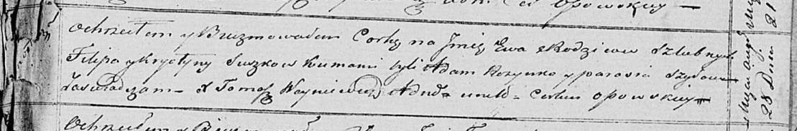

**Сушко Ева Филипова (Suszkowna Ewa)**

28 августа 1821 г -- крещение (НИАБ 136-13-894, лист 107, №41/1821-р
(ориг)).

**НИАБ 136-13-894:** Лист 107. **Метрическая запись №41/1821-р (ориг).**

{width="6.496527777777778in"
height="1.0781725721784776in"}

Осовская Покровская церковь. 28 августа 1821 года. Метрическая запись о
крещении.

Suszkowna Ewa -- дочь родителей с деревни Замосточье.

Suszko Filip -- отец.

Suszkowa Krystyna -- мать.

Rozynko Adam -- кум.

Szyłowa Parasia -- кума.

Woyniewicz Tomasz -- ксёндз.
