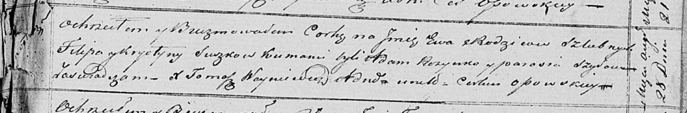

**Сушко Ян Филипов (Suszko Jan)**

14 мая 1818 г -- крещение (НИАБ 136-13-894, лист 98об, №15/1818-р
(ориг)).

**НИАБ 136-13-894:** Лист 98об. **Метрическая запись №15/1818-р
(ориг).**

{width="6.496527777777778in"
height="1.464384295713036in"}

Осовская Покровская церковь. 14 мая 1818 года. Метрическая запись о
крещении.

Suszko Jan -- сын родителей с деревни Замосточье.

Suszko Filip -- отец.

Suszkowa Krystyna -- мать.

Rozynko Adam -- кум.

Szyłakowa Parasia -- кума.

Woyniewicz Tomasz -- ксёндз.
