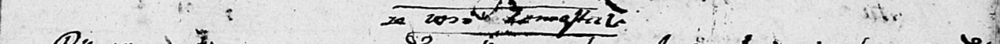
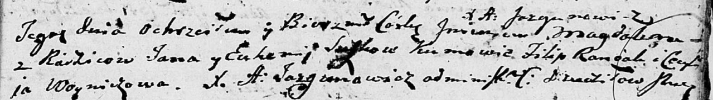

**Сушко Магдалена Янкова (Suszkowna Magdalena)**

12 октября 1802 г -- крещение (НИАБ 136-13-894, лист 48, №36/1802-р
(ориг)).

**НИАБ 136-13-894:** Лист 48. **Метрическая запись №36/1802-р (ориг).**

Дедиловичская Покровская церковь. 12 октября 1802 года. Метрическая
запись о крещении.

Suszkowna Magdalena -- дочь родителей с деревни Замосточье.

Suszko Jan -- отец.

Suszkowa Euhenija -- мать.

Randak Filip -- кум.

Woyniczowa Cecylija -- кума.

Jazgunowicz Antoni -- ксёндз.
