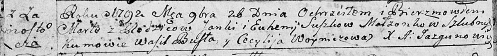

**Сушко Марта Янкова (Suszkowna Marta)**

26 ноября 1792 г -- крещение (НИАБ 136-13-894, лист 17об, №80/1792-р
(ориг)).

**НИАБ 136-13-894:** Лист 17-об. **Метрическая запись №80/1792-р
(ориг).**

Дедиловичская Покровская церковь. 26 ноября 1792 года. Метрическая
запись о крещении.

Suszkowna Marta -- дочь родителей с деревни Замосточье.

Suszko Janka -- отец.

Suszkowa Euhenija -- мать.

Busła Wasil - кум.

Woyniczowa Cecylija - кума.

Jazgunowicz Antoni -- ксёндз.
