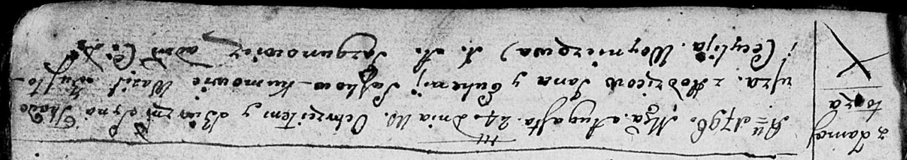
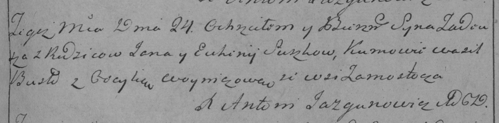

**Сушко Тадей Янков (Suszko Tadeusz)**

24 августа 1796 г -- крещение (НИАБ 136-13-894, лист 30, №74/1796-р
(ориг)), (РГИА 823-2-18, лист 257, №44/1796-р (коп)).

**НИАБ 136-13-894:** Лист 30. **Метрическая запись №74/1796-р (ориг).**

Дедиловичская Покровская церковь. 24 августа 1796 года. Метрическая
запись о крещении.

Suszko Tadeusz -- сын родителей с деревни Замосточье.

Suszko Jan -- отец.

Suszkowa Euhenija -- мать.

Busko Wasil - кум.

Woyniczowa Cecylija - кума.

Jazgunowicz Antoni -- ксёндз.

**РГИА 823-2-18:** Лист 257. **Метрическая запись №44/1796-р (коп).**

Дедиловичская Покровская церковь. 24 августа 1796 года. Метрическая
запись о крещении.

Suszko Tadeusz -- сын родителей с деревни Замосточье.

Suszko Jan -- отец.

Suszkowa Euhenija -- мать.

Busło Wasil -- кум.

Woyniczowa Cecylia -- кума.

Jazgunowicz Antoni -- ксёндз.
