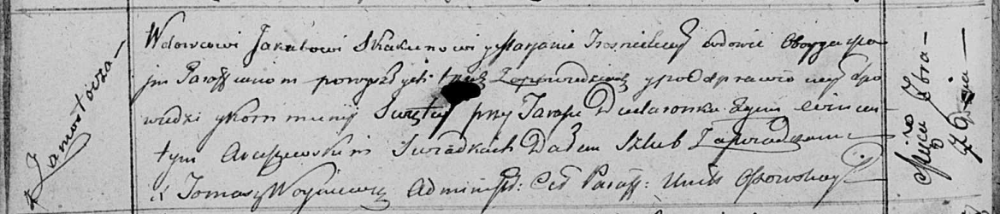

**Скакун (в предыдущем браке Тросницкая) Марьяна (Skakunowa (Trosnicka)
Marjana)**

7 сентября 1813 г -- венчание с вдовцом Якубом Скакуном с деревни
Замосточье (НИАБ 136-13-920, лист 19об, №13/1813-б (ориг)).

**НИАБ 136-13-920:** Лист 19об. **Метрическая запись №13/1813-б
(ориг).**

{width="6.496527777777778in"
height="1.3946511373578303in"}

Осовская Покровская церковь. 7 сентября 1813 года. Запись о венчании.

Skakun Jakub -- жених, вдовец, парафии Осовской, с деревни Замосточье.

Trosnicka Marjana -- невеста, вдова, парафии Осовской, с деревни
Замосточье.

Dudaronek Janka -- свидетель.

Arciszewski Wincenty -- свидетель.

Woyniewicz Tomasz -- ксёндз.
