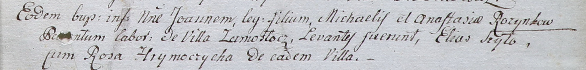

**Хромович Роза (Chrymoczycha Roza)**

6 апреля 1802 г -- крестная мать Иоанна, сына Михала и Анастасии
Розынков с деревни Замосточье (НИАБ 937-4-32, лист 6, №9/1802-р).

**НИАБ 937-4-32:** Лист 6. **Метрическая запись №9/1802-р.**

{width="6.496527777777778in"
height="0.7854166666666667in"}

Дедиловичский костел Наисвятейшего Сердца Иисуса. 6 апреля 1802 года.
Метрическая запись о крещении.

Rozynko Joann -- сын крестьян с деревни Замосточье.

Rozynko Michael -- отец.

Rozynkowa Anastasia -- мать.

Szyło Elias -- крестный отец.

Hrymoczycha Rosa -- крестная мать, с деревни Замосточье.

Linhart Hyacinthus -- ксёндз.
