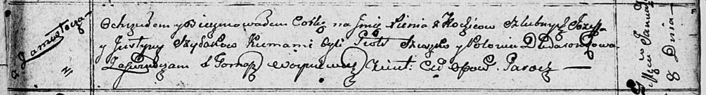

**Шилак Иосиф (Szyłak Jozef)**

8 января 1811 г -- крещение дочери Ксени (НИАБ 136-13-894, лист 80,
№4/1811-р (ориг)).

16 июня 1816 г -- отпевание (НИАБ 136-13-919, лист 27, №45/1813-у
(ориг)).

**НИАБ 136-13-894:** Лист 80. **Метрическая запись №4/1811-р (ориг).**

Осовская Покровская церковь. 8 января 1811 года. Метрическая запись о
крещении.

Szyłakowna Xienia -- дочь родителей с деревни Замосточье.

Szyłak Jozef -- отец.

Szyłakowa Justyna -- мать.

Szuszko Piotr -- кум.

Dudaronkowa Polonia -- кума.

Woyniewicz Tomasz -- ксёндз.

**НИАБ 136-13-919:** Лист 27. **Метрическая запись №45/1813-у (ориг).**

Осовская униатская церковь. 16 июня 1813 года. Метрическая запись об
отпевании.

Szyłak Jozef -- умерший, с деревни Замосточье, похоронен на кладбище
деревни Осово.

Woyniewicz Tomasz -- ксёндз.
