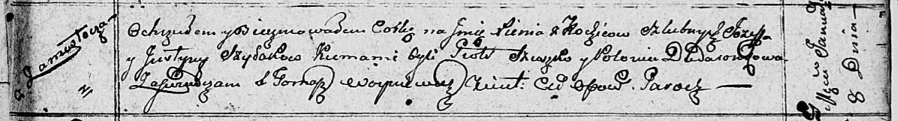

**Шилак Ксеня Иосифова (Szyłakowna Xienia)**

8 января 1811 г -- крещение (НИАБ 136-13-894, лист 80, №4/1811-р
(ориг)).

**НИАБ 136-13-894:** Лист 80. **Метрическая запись №4/1811-р (ориг).**

Осовская Покровская церковь. 8 января 1811 года. Метрическая запись о
крещении.

Szyłakowna Xienia -- дочь родителей с деревни Замосточье.

Szyłak Jozef -- отец.

Szyłakowa Justyna -- мать.

Szuszko Piotr -- кум.

Dudaronkowa Polonia -- кума.

Woyniewicz Tomasz -- ксёндз.
