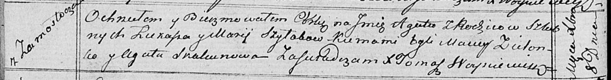

**Шилак Агата Лукашова (Szyłakowna Agata)**

8 декабря 1818 г -- крещение (НИАБ 136-13-894, лист 99об, №44/1818-р
(ориг)).

**НИАБ 136-13-894:** Лист 99об. **Метрическая запись №44/1818-р
(ориг).**

Осовская Покровская церковь. 8 декабря 1818 года. Метрическая запись о
крещении.

Szyłakowna Agata -- дочь родителей с деревни Замосточье.

Szyłak Łukasz -- отец.

Szyłakowa Marija -- мать.

Zielonko Maciey -- кум.

Skakunowa Agata -- кума.

Woyniewicz Tomasz -- ксёндз.
