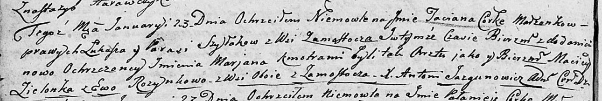
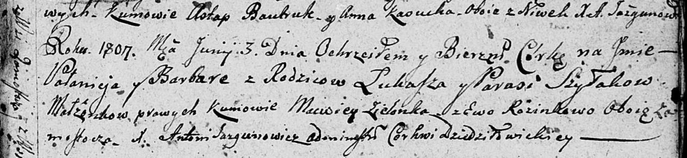
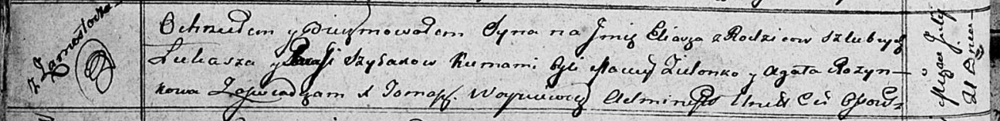

**Шилак Лукаш (Szyłak Łukasz)**

23 января 1805 г -- крещение дочери Татьяны Марьяны (НИАБ 136-13-894,
лист 56об, №10/1805-р (ориг)).

3 июня 1807 г -- крещение дочери Паланеи Варвары (НИАБ 136-13-894, лист
63, №29/1807-р (ориг)).

21 июля 1812 г -- крещение сына Ильи (НИАБ 136-13-894, лист 84об,
№35/1812-р (ориг)).

**НИАБ 136-13-894:** Лист 56об. **Метрическая запись №10/1805-р
(ориг).**

Дедиловичская Покровская церковь. 23 января 1805 года. Метрическая
запись о крещении.

Szyłakowna Taciana Marjana -- дочь родителей с деревни Замосточье.

Szyłak Łukasz -- отец.

Szyłakowa Parasia -- мать.

Zielonka Maciey -- кум, с деревни Замосточье.

Rozynkowa Ewa -- кума, с деревни Замосточье.

Jazgunowicz Antoni -- ксёндз.

**НИАБ 136-13-894:** Лист 63. **Метрическая запись №29/1807-р (ориг).**

Дедиловичская Покровская церковь. 3 июня 1807 года. Метрическая запись о
крещении.

Szyłakowna Pałanieja Barbara -- дочь родителей с деревни Замосточье.

Szyłak Łukasz -- отец.

Szyłakowa Parasia -- мать.

Zielonka Macwey -- кум, с деревни Замосточье.

Rozinkowa Ewa -- кума, с деревни Замосточье.

Jazgunowicz Antoni -- ксёндз.

**НИАБ 136-13-894:** Лист 84об. **Метрическая запись №35/1812-р
(ориг).**

Осовская Покровская церковь. 21 июля 1812 года. Метрическая запись о
крещении.

Szyłak Eliasz -- сын родителей с деревни Замосточье.

Szyłak Łukasz -- отец.

Szyłakowa Parasia -- мать.

Zielonko Maciey -- кум.

Rozynkowa Agata -- кума.

Woyniewicz Tomasz -- ксёндз.
