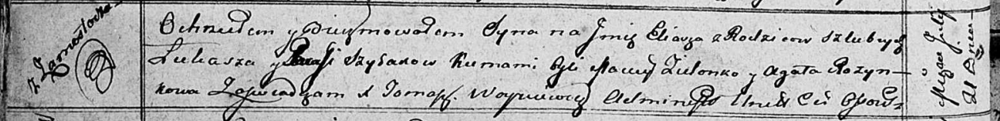

**Шилак Паланея Лукашова (Szyłakowna Pałanieja Barbara)**

3 июня 1807 г -- крещение (НИАБ 136-13-894, лист 63, №29/1807-р (ориг)).

**НИАБ 136-13-894:** Лист 63. **Метрическая запись №29/1807-р (ориг).**

{width="6.496527777777778in"
height="1.5019324146981627in"}

Дедиловичская Покровская церковь. 3 июня 1807 года. Метрическая запись о
крещении.

Szyłakowna Pałanieja Barbara -- дочь родителей с деревни Замосточье.

Szyłak Łukasz -- отец.

Szyłakowa Parasia -- мать.

Zielonka Macwey -- кум, с деревни Замосточье.

Rozinkowa Ewa -- кума, с деревни Замосточье.

Jazgunowicz Antoni -- ксёндз.
