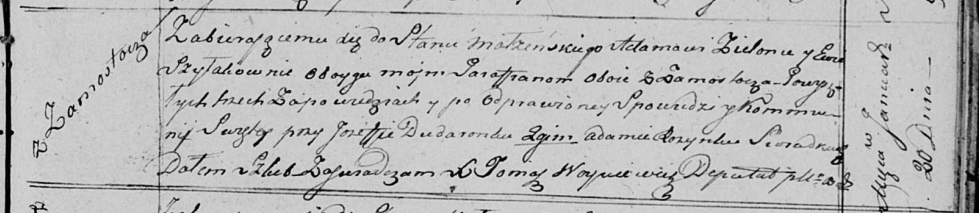

**Зелёнка (Шилак) Ева (Zielonkowa (Szyłakowna) Ewa)**

20 января 1818 г -- венчание с Адамом Зелёнкой с деревни Замосточье
(НИАБ 136-13-920, лист 25, №2/1818-б (ориг)).

**НИАБ 136-13-920:** Лист 25. **Метрическая запись №2/1818-б (ориг).**

{width="6.496527777777778in"
height="1.4134251968503937in"}

Осовская Покровская церковь. 20 января 1818 года. Запись о венчании.

Zielonka Adam -- жених, парафии Осовской, с деревни Замосточье.

Szyłakowna Ewa -- невеста, парафии Осовской, с деревни Замосточье.

Dudaronek Jozef -- свидетель.

Rozynka Adam -- свидетель.

Woyniewicz Tomasz -- ксёндз.
