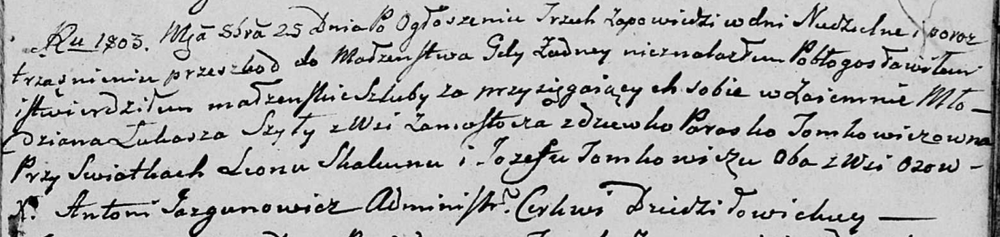
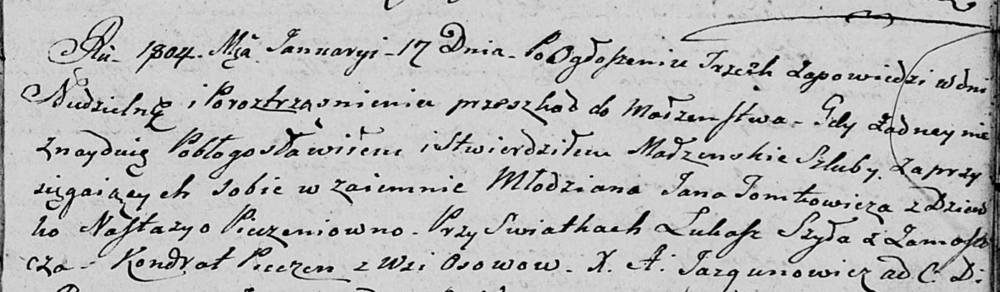

**Шило Лукаш (Szyło Łukasz)**

25 октября 1803 г -- венчание с девкой Параской Томкович (НИАБ
136-13-920, лист 9, №4/1803-б (ориг)).

17 января 1804 г -- свидетель венчания молодого Яна Томковича с деревни
Осово с девкой Настасьей Печень (НИАБ 136-13-920, лист 10, №1/1804-б
(ориг)).

18 июля 1820 г -- крещение дочери Макрыны (НИАБ 136-13-894, лист 104об,
№23/1820-р (ориг)).

**НИАБ 136-13-920:** Лист 9. **Метрическая запись №4/1803-б (ориг).**

Дедиловичская Покровская церковь. 25 октября 1803 года. Метрическая
запись о венчании.

Szyło Łukasz -- жених, молодой, с деревни Замосточье.

Tomkowiczowna Paraska -- невеста, девка.

Skakun Leon -- свидетель, с деревни Осовo.

Tomkowicz Jozef -- свидетель, с деревни Осовo.

Jazgunowicz Antoni -- ксёндз.

**НИАБ 136-13-920:** Лист 10. **Метрическая запись №1/1804-б (ориг).**

Дедиловичская Покровская церковь. 17 января 1804 года. Метрическая
запись о венчании.

Tomkowicz Jan -- жених, молодой с деревни \[Осово\].

Pieczaniowna Nastazya -- невеста, девка.

Szyła Łukasz -- свидетель, с деревни Замосточье.

Pieczan Kondrat -- свидетель, с деревни Осовo.

Jazgunowicz Antoni -- ксёндз.

**НИАБ 136-13-894:** Лист 104об. **Метрическая запись №23/1820-р
(ориг).**

Осовская Покровская церковь. 18 июля 1820 года. Метрическая запись о
крещении.

Szyłowna Makryna -- дочь родителей с деревни Замосточье.

Szyło Łukasz -- отец.

Szyłowa Parasia -- мать.

Zielonko Maciey -- кум.

Suszkowa Agata -- кума.

Woyniewicz Tomasz -- ксёндз.
