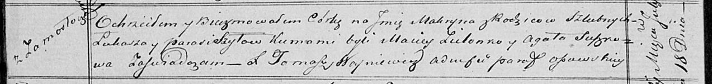

**Шило Макрына Лукашова (Szyłowna Makryna)**

18 июля 1820 г -- крещение (НИАБ 136-13-894, лист 104об, №23/1820-р
(ориг)).

**НИАБ 136-13-894:** Лист 104об. **Метрическая запись №23/1820-р
(ориг).**

{width="6.496527777777778in"
height="0.7757753718285214in"}

Осовская Покровская церковь. 18 июля 1820 года. Метрическая запись о
крещении.

Szyłowna Makryna -- дочь родителей с деревни Замосточье.

Szyło Łukasz -- отец.

Szyłowa Parasia -- мать.

Zielonko Maciey -- кум.

Suszkowa Agata -- кума.

Woyniewicz Tomasz -- ксёндз.
