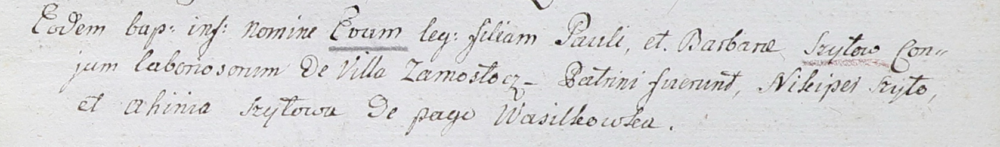
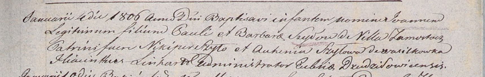

**Шило Барбара (Szyłowa Barbara)**

28 ноября 1802 -- крещение дочери Евы (НИАБ 937-4-32, лист 8,
№45/1802-р).

4 января 1806 г -- крещение сына Иоанна (НИАБ 937-4-32, лист 13,
№1/1806-р).

**НИАБ 937-4-32:** Лист 8. **Метрическая запись №45/1802-р.**

Дедиловичский костел Наисвятейшего Сердца Иисуса. 28 ноября 1802 года.
Метрическая запись о крещении.

Szyłowna Eva -- дочь крестьян с деревни Замосточье.

Szyło Paul -- отец.

Szyłowa Barbara -- мать.

Szyło Nikiper -- крестный отец.

Szyłowa Ahinia -- крестная мать, с деревни Васильковка.

Linhart Hyacinthus -- ксёндз.

**НИАБ 937-4-32:** Лист 13. **Метрическая запись №1/1806-р.**

Дедиловичский костел Наисвятейшего Сердца Иисуса. 4 января 1806 года.
Метрическая запись о крещении.

Szyło Jоann -- сын родителей с деревни Замосточье.

Szyło Paul -- отец.

Szyłowa Barbara -- мать.

Szyło Nikiper -- крестный отец.

Szyłowa Auhinia -- крестная мать, с деревни Васильковка.

Linhart Hiacinthus -- ксёндз.
