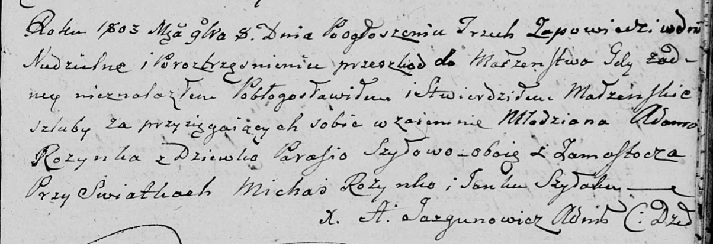

**Розынко (Шило) Парася (Rozynkowa Parasia, Prosia, Paraxeda z Szyłow)**

8 ноября 1803 г -- венчание с молодым Адамом Розынкой с деревни
Замосточье (НИАБ 136-13-920, лист 10, №12/1803-б (ориг)).

**НИАБ 136-13-920:** Лист 10. **Метрическая запись №12/1803-б (ориг).**

{width="6.496527777777778in"
height="2.228759842519685in"}

Дедиловичская Покровская церковь. 8 ноября 1803 года. Метрическая запись
о венчании.

Rozynka Adam -- жених, молодой, с деревни Замосточье.

Szyłowa Parasia -- невеста, девка, с деревни Замосточье.

Rozynko Michaś -- свидетель.

Szyłak Janka -- свидетель.

Jazgunowicz Antoni -- ксёндз.
