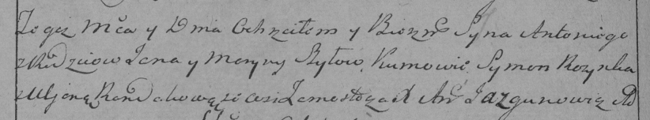

**Шило Антон Янков (Szyło Antoni)**

23 сентября 1795 г -- крещение (НИАБ 136-13-894, лист 25об, №39/1795-р
(ориг)), (РГИА 823-2-18, лист 253об, №32/1795-р (коп)).

**НИАБ 136-13-894:** Лист 25об. **Метрическая запись №39/1795-р
(ориг).**

{width="6.496527777777778in"
height="0.8810444006999125in"}

Дедиловичская Покровская церковь. 23 сентября 1795 года. Метрическая
запись о крещении.

Szyło Antoni -- сын родителей с деревни Замосточье.

Szyło Jan -- отец.

Szyłowa Maryna -- мать.

Rozynko Symon - кум.

Randakowa Ullana - кума.

Jazgunowicz Antoni -- ксёндз.

**РГИА 823-2-18:** Лист 253об. **Метрическая запись №32/1795-р (коп).**

{width="6.496527777777778in"
height="1.2013888888888888in"}

Дедиловичская Покровская церковь. 23 сентября 1795 года. Метрическая
запись о крещении.

Szyło Antoni -- сын родителей с деревни Замосточье.

Szyło Jan -- отец.

Szyłowa Maryna -- мать.

Rozynka Symon -- кум.

Randakowa Uljana -- кума.

Jazgunowicz Antoni -- ксёндз.
