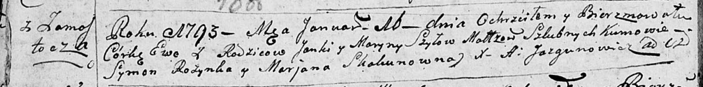
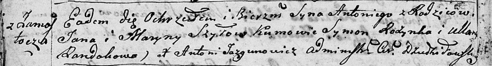
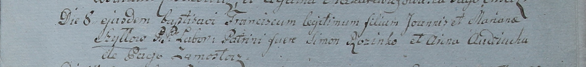
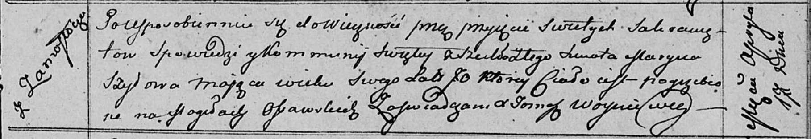

**Шило Марына (Szyłowa Maryna, Mariana)**

16 января 1793 г -- крещение дочери Евы (НИАБ 136-13-894, лист 18об,
№11/1793-р (ориг)).

23 сентября 1795 г -- крещение сына Антона (НИАБ 136-13-894, лист 25об,
№39/1795-р (ориг)), (РГИА 823-2-18, лист 253об, №32/1795-р (коп)).

8 сентября 1799 г -- крещение сына Франциска (НИАБ 1781-27-199, лист
129, №40/1799-р).

17 апреля 1813 г -- отпевание, умерла в возрасте 70 лет (родилась около
1743 г) (НИАБ 136-13-919, лист 27, №40/1813-у (ориг)).

**НИАБ 136-13-894:** Лист 18-об. **Метрическая запись №11/1793-р
(ориг).**

Дедиловичская Покровская церковь. 16 января 1793 года. Метрическая
запись о крещении.

Szyłowna Ewa -- дочь родителей с деревни Замосточье.

Szyło Janka -- отец.

Szyłowa Maryna -- мать.

Rozynka Symon - кум.

Skakunowna Marjana - кума.

Jazgunowicz Antoni -- ксёндз.

**НИАБ 136-13-894:** Лист 25об. **Метрическая запись №39/1795-р
(ориг).**

Дедиловичская Покровская церковь. 23 сентября 1795 года. Метрическая
запись о крещении.

Szyło Antoni -- сын родителей с деревни Замосточье.

Szyło Jan -- отец.

Szyłowa Maryna -- мать.

Rozynko Symon - кум.

Randakowa Ullana - кума.

Jazgunowicz Antoni -- ксёндз.

**РГИА 823-2-18:** Лист 253об. **Метрическая запись №32/1795-р (коп).**

Дедиловичская Покровская церковь. 23 сентября 1795 года. Метрическая
запись о крещении.

Szyło Antoni -- сын родителей с деревни Замосточье.

Szyło Jan -- отец.

Szyłowa Maryna -- мать.

Rozynka Symon -- кум.

Randakowa Uljana -- кума.

Jazgunowicz Antoni -- ксёндз.

**НИАБ 1781-27-199:** Лист 129. **Метрическая запись №40/1799-р.**

Дедиловичский костел Наисвятейшего Сердца Иисуса. 8 сентября 1799 года.
Метрическая запись о крещении.

Szyłło Francisc -- сын крестьян с деревни Замосточье.

Szyłło Joann -- отец.

Szyłłowa Mariana -- мать.

Rozinko Simon -- крестный отец.

Audziucha Anna -- крестная мать.

Linhart Hyacinthus -- ксёндз.

**НИАБ 136-13-919:** Лист 27. **Метрическая запись №40/1813-у (ориг).**

Осовская униатская церковь. 17 апреля 1813 года. Метрическая запись об
отпевании.

Szyłowa Maryna -- умершая, 70 лет, с деревни Замосточье, похоронена на
кладбище деревни Осово.

Woyniewicz Tomasz -- ксёндз.
