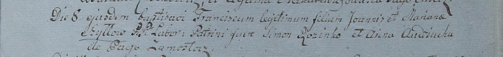

**Шило Франциск Янков (Szyłło Francisc)**

8 сентября 1799 г -- крещение сына Франциска (НИАБ 1781-27-199, лист
129, №40/1799-р).

**НИАБ 1781-27-199:** Лист 129. **Метрическая запись №40/1799-р.**

Дедиловичский костел Наисвятейшего Сердца Иисуса. 8 сентября 1799 года.
Метрическая запись о крещении.

Szyłło Francisc -- сын крестьян с деревни Замосточье.

Szyłło Joann -- отец.

Szyłłowa Mariana -- мать.

Rozinko Simon -- крестный отец.

Audziucha Anna -- крестная мать.

Linhart Hyacinthus -- ксёндз.
