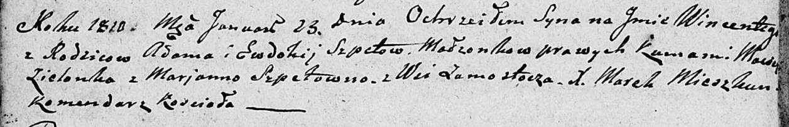

**Шпет Винценты Адамов (Szpet Wincenty)**

23 января 1810 г -- крещение (НИАБ 136-13-894, лист 76об, №4/1810-р
(ориг)).

**НИАБ 136-13-894:** Лист 76об. **Метрическая запись №4/1810-р (ориг).**

{width="6.496527777777778in"
height="1.05537510936133in"}

Дедиловичская Покровская церковь. 23 января 1810 года. Метрическая
запись о крещении.

Szpet Wincenty -- сын родителей из деревни Замосточье.

Szpet Adam -- отец.

Szpetowa Ewdokija -- мать.

Zielonka Maciey -- кум.

Szpetowna Marianna -- кума.

Mieszkun Marek -- ксёндз, комендант Дедиловичского костела.
